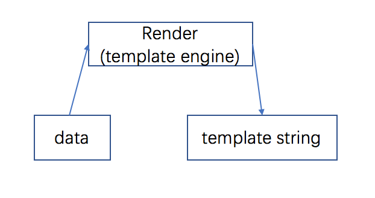
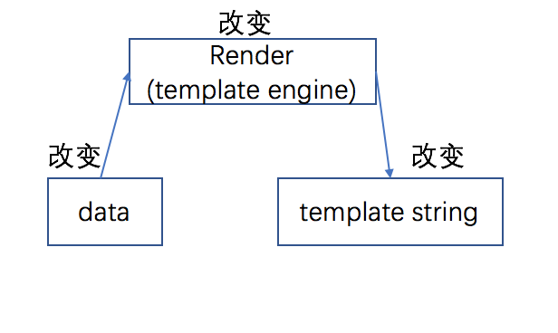

# 打造一款自己的js模板引擎-1

### 需求

在页面上输出

```html
<div>
    我叫<span class="name">supershy</span>，职业是<span class="career">前端开发工程师</span>
</div>
```

其中name和career是后台返回的值

```json
{
    "name": "guoyaqi",
    "career": "前端开发工程师"
}
```

看到这个需求，映入脑海的第一反应就是拼接字符串

```javascript
function render(data){
    return '<div>我叫<span class="name">' + data.name + '</span>，职业是<span class="career">' + data.career + '</span></div>'
}

render({"name": "guoyaqi","career": "前端开发工程师"}) // <div>我叫<span class="name">guoyaqi</span>，职业是<span class="career">前端开发工程师</span></div>
```

### 需求改变

将页面输出的name改为nickname

```javascript
function render(data){
    return '<div>我叫<span class="nickname">' + data.nickname + '</span>，职业是<span class="career">' + data.career + '</span></div>'
}

render({"nickname": "qiqi","career": "前端开发工程师"}) // <div>我叫<span class="nickname">qiqi</span>，职业是<span class="career">前端开发工程师</span></div>
```



可以看出数据流的走向：data->render->template string，因为在render函数中采用的硬编码，当需求改变，这三处都需要跟着改变。



仔细观察data和字符串模板，nickname->nickname，career->career，通过这个特点我们可以写个更通用的引擎让data和字符串模板的值自动关联起来。

```html
<script id="tmpl" type="text/html">
    <div>
        我叫<span class="name">{{name}}</span>，职业是<span class="career">{{career}}</span>
    </div>
</script>
<!-- 由于type是text/html，并不会触发js执行脚本，而是充当一个隐藏的wrapper。当然也可以写个div，属性为隐藏 -->
```

这里我们用双括号来表示占位符，当然用其它特殊符号都可以（可以参照vue、angular等）。

**通用引擎**

* 自动匹配占位符
* 可以自动关联数据

```javascript
var reg = /(?<={{)\w+(?=}})/g
document.querySelector('#tmpl').innerHTML.match(reg) // [name, career]
```

通过简单的正则我可以将模板中的占位符提取出来

###完整实现

```javascript
function template(tmpl, data){
    var reg = /(?<={{)\w+(?=}})/g
    var tmplStr = tmpl
    tmpl.match(reg).forEach(function(key){
        tmplStr = tmplStr.replace('{{'+ key +'}}', data[key])
    })
    
    return tmplStr
}

template(document.querySelector('#tmpl').innerHTML, {"name": "qiqi","career": "前端开发工程师"}) // <div>我叫<span class="name">qiqi</span>，职业是<span class="career">前端开发工程师</span></div>
```

